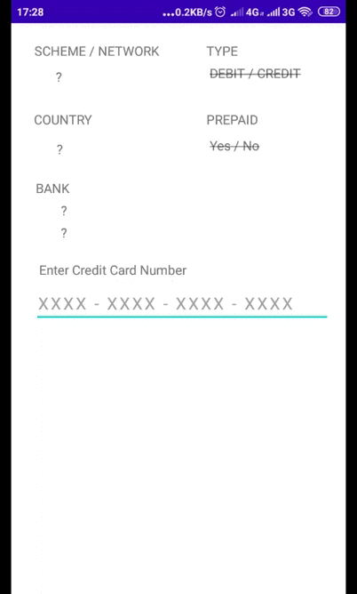

# GlobalAccelex

An mobile service for looking up credit and debit card meta data based on https://binlist.net/ in realtime

## Description
The mobile application is a single screen mobile app that returns a debit/credit card info in realtime. Using the MVVM Architecture pattern. When the user enters the first 6-9 digits of his debit/credit card. The app would displays the following card information: 
- Card Scheme
- Card type
- Bank
- Country
- Card number length
- Prepaid or Postpaid

### Architecture

The project uses MVVM architecture MV-VM which is a is a software architectural pattern which facilitates separation of development UI (Activity or Fragment) from the development of the business logic or back-end logic (the data model), which is ideal for small to medium sized projects. 

The following is the major components folders/files of my project
1) /view-model - This is my view model, which interacts directly with the UI and also with the network service
2) /models - This contains my model classes
3) /repository - This contains my repository classes to lookup BIN
4) /views - This contains my views/Activity files
4) /services - This initiates a direct communication with the webservice

Others include:
1. /common
2. /utils etc

### Libraries used 
The Following is list of major libraries used in app.
1) Kotlin Coroutine - Coroutines are a Kotlin feature that converts async callbacks for long-running tasks, such as database or network access, into sequential code.  The pattern of async and await in other languages is based on coroutines in Kotlin. [Read More](https://kotlinlang.org/docs/coroutines-overview.html#sample-projects)
2) Retrofit for web Service Requests - Retrofit is type-safe HTTP client for Android and Java by Square, Inc. It is an open source library which simplifies HTTP communication by turning remote APIs into declarative, type-safe interfaces. It makes it relatively easy to retrieve and upload JSON (or other structured data) via a REST based webservice. It automatically serializes the JSON response using a POJO which must be defined in advance for the JSON Structure. Learn More: [Here](https://square.github.io/retrofit/) and [Here](https://medium.com/cr8resume/make-your-hand-dirty-with-retrofit-2-a-type-safe-http-client-for-android-and-java-c546f88b3a51)
3) OkHttp3 Logging Interceptor - An OkHttp interceptor which logs request and response information. Can be applied to web requests in an application. [Read More](https://square.github.io/okhttp/)
4) LiveData - LiveData, is one of the Android Architecture Components, it lets you build data objects that notify views when the underlying database changes. [Read More](https://developer.android.com/topic/libraries/architecture/livedata)

## Authors

* **Musa Musa A.**  - [lintdeveloper](https://github.com/lintdeveloper)

## License
This project is licensed under the MIT License - see the [LICENSE.md](LICENSE.md) file for details
